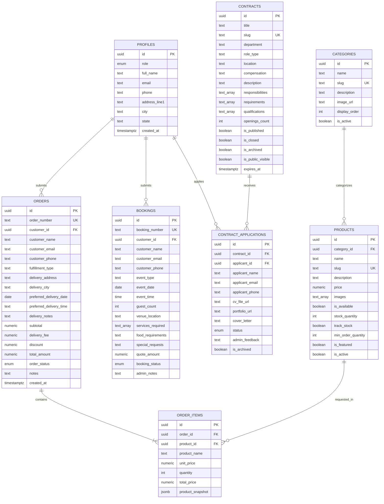

# Tory's Treats — Supabase & PostgreSQL Database Schema (Order Request Model)

**Database Engine:** PostgreSQL 15+ (Supabase)  
**Schema Version:** 1.1.0  
**Security Model:** Row Level Security (RLS) enabled on 100% of tables  
**Payment Model:** Offline Order Processing & Confirmation (Zero Payment Tables/Enums)  

---

## 1. Entity Relationship Diagram (ERD)



---

## 2. PostgreSQL DDL Specification

```sql
-- 1. EXTENSIONS
CREATE EXTENSION IF NOT EXISTS "uuid-ossp";
CREATE EXTENSION IF NOT EXISTS "pgcrypto";

-- 2. ENUM TYPES
CREATE TYPE user_role AS ENUM (
    'CUSTOMER',
    'ADMIN',
    'SUPER_ADMIN',
    'STAFF'
);

CREATE TYPE order_status AS ENUM (
    'PENDING',
    'CONFIRMED',
    'PROCESSING',
    'READY',
    'DELIVERED',
    'CANCELLED'
);

CREATE TYPE booking_status AS ENUM (
    'PENDING',
    'REVIEWING',
    'QUOTED',
    'CONFIRMED',
    'IN_PROGRESS',
    'COMPLETED',
    'REJECTED'
);

CREATE TYPE contract_status AS ENUM (
    'DRAFT',
    'PUBLISHED',
    'CLOSED',
    'ARCHIVED'
);

CREATE TYPE application_status AS ENUM (
    'SUBMITTED',
    'UNDER_REVIEW',
    'SHORTLISTED',
    'APPROVED',
    'REJECTED',
    'ARCHIVED'
);

-- 3. PROFILES TABLE (Linked with Supabase Auth)
CREATE TABLE public.profiles (
    id UUID PRIMARY KEY REFERENCES auth.users(id) ON DELETE CASCADE,
    role user_role NOT NULL DEFAULT 'CUSTOMER',
    full_name TEXT NOT NULL,
    email TEXT NOT NULL,
    phone TEXT,
    address_line1 TEXT,
    address_line2 TEXT,
    city TEXT,
    state TEXT,
    postal_code TEXT,
    avatar_url TEXT,
    created_at TIMESTAMPTZ NOT NULL DEFAULT NOW(),
    updated_at TIMESTAMPTZ NOT NULL DEFAULT NOW()
);

-- 4. CATEGORIES TABLE
CREATE TABLE public.categories (
    id UUID PRIMARY KEY DEFAULT uuid_generate_v4(),
    name TEXT NOT NULL UNIQUE,
    slug TEXT NOT NULL UNIQUE,
    description TEXT,
    image_url TEXT,
    display_order INT NOT NULL DEFAULT 0,
    is_active BOOLEAN NOT NULL DEFAULT TRUE,
    created_at TIMESTAMPTZ NOT NULL DEFAULT NOW(),
    updated_at TIMESTAMPTZ NOT NULL DEFAULT NOW()
);

-- 5. PRODUCTS TABLE
CREATE TABLE public.products (
    id UUID PRIMARY KEY DEFAULT uuid_generate_v4(),
    category_id UUID REFERENCES public.categories(id) ON DELETE SET NULL,
    name TEXT NOT NULL,
    slug TEXT NOT NULL UNIQUE,
    description TEXT,
    price NUMERIC(10,2) NOT NULL CHECK (price >= 0),
    images TEXT[] NOT NULL DEFAULT '{}',
    is_available BOOLEAN NOT NULL DEFAULT TRUE,
    stock_quantity INT NOT NULL DEFAULT 0 CHECK (stock_quantity >= 0),
    track_stock BOOLEAN NOT NULL DEFAULT FALSE,
    min_order_quantity INT NOT NULL DEFAULT 1 CHECK (min_order_quantity >= 1),
    is_featured BOOLEAN NOT NULL DEFAULT FALSE,
    is_active BOOLEAN NOT NULL DEFAULT TRUE,
    created_at TIMESTAMPTZ NOT NULL DEFAULT NOW(),
    updated_at TIMESTAMPTZ NOT NULL DEFAULT NOW()
);

-- 6. ORDERS TABLE (Direct Order Requests)
CREATE TABLE public.orders (
    id UUID PRIMARY KEY DEFAULT uuid_generate_v4(),
    order_number TEXT NOT NULL UNIQUE,
    customer_id UUID REFERENCES public.profiles(id) ON DELETE SET NULL,
    customer_name TEXT NOT NULL,
    customer_email TEXT NOT NULL,
    customer_phone TEXT NOT NULL,
    fulfillment_type TEXT NOT NULL DEFAULT 'DELIVERY' CHECK (fulfillment_type IN ('DELIVERY', 'PICKUP')),
    delivery_address TEXT,
    delivery_city TEXT DEFAULT 'Lagos',
    preferred_delivery_date DATE,
    preferred_delivery_time TEXT,
    delivery_notes TEXT,
    subtotal NUMERIC(10,2) NOT NULL CHECK (subtotal >= 0),
    delivery_fee NUMERIC(10,2) NOT NULL DEFAULT 0.00 CHECK (delivery_fee >= 0),
    discount NUMERIC(10,2) NOT NULL DEFAULT 0.00 CHECK (discount >= 0),
    total_amount NUMERIC(10,2) NOT NULL CHECK (total_amount >= 0),
    order_status order_status NOT NULL DEFAULT 'PENDING',
    notes TEXT,
    created_at TIMESTAMPTZ NOT NULL DEFAULT NOW(),
    updated_at TIMESTAMPTZ NOT NULL DEFAULT NOW()
);

-- 7. ORDER ITEMS TABLE
CREATE TABLE public.order_items (
    id UUID PRIMARY KEY DEFAULT uuid_generate_v4(),
    order_id UUID NOT NULL REFERENCES public.orders(id) ON DELETE CASCADE,
    product_id UUID REFERENCES public.products(id) ON DELETE SET NULL,
    product_name TEXT NOT NULL,
    unit_price NUMERIC(10,2) NOT NULL CHECK (unit_price >= 0),
    quantity INT NOT NULL CHECK (quantity >= 1),
    total_price NUMERIC(10,2) NOT NULL CHECK (total_price >= 0),
    product_snapshot JSONB NOT NULL DEFAULT '{}',
    created_at TIMESTAMPTZ NOT NULL DEFAULT NOW()
);

-- 8. BOOKINGS TABLE (Event & Catering Inquiries)
CREATE TABLE public.bookings (
    id UUID PRIMARY KEY DEFAULT uuid_generate_v4(),
    booking_number TEXT NOT NULL UNIQUE,
    customer_id UUID REFERENCES public.profiles(id) ON DELETE SET NULL,
    customer_name TEXT NOT NULL,
    customer_email TEXT NOT NULL,
    customer_phone TEXT NOT NULL,
    event_type TEXT NOT NULL,
    event_date DATE NOT NULL,
    event_time TIME,
    guest_count INT NOT NULL CHECK (guest_count >= 1),
    venue_location TEXT NOT NULL,
    services_required TEXT[] NOT NULL DEFAULT '{}',
    food_requirements TEXT NOT NULL,
    special_requests TEXT,
    quote_amount NUMERIC(10,2) DEFAULT NULL CHECK (quote_amount IS NULL OR quote_amount >= 0),
    booking_status booking_status NOT NULL DEFAULT 'PENDING',
    admin_notes TEXT,
    created_at TIMESTAMPTZ NOT NULL DEFAULT NOW(),
    updated_at TIMESTAMPTZ NOT NULL DEFAULT NOW()
);

-- 9. CONTRACTS TABLE (Recruitment Opportunities)
CREATE TABLE public.contracts (
    id UUID PRIMARY KEY DEFAULT uuid_generate_v4(),
    title TEXT NOT NULL,
    slug TEXT NOT NULL UNIQUE,
    department TEXT NOT NULL,
    role_type TEXT NOT NULL,
    location TEXT NOT NULL DEFAULT 'Lagos, Nigeria',
    compensation TEXT NOT NULL,
    description TEXT NOT NULL,
    responsibilities TEXT[] NOT NULL DEFAULT '{}',
    requirements TEXT[] NOT NULL DEFAULT '{}',
    qualifications TEXT[] NOT NULL DEFAULT '{}',
    openings_count INT NOT NULL DEFAULT 1 CHECK (openings_count >= 1),
    is_published BOOLEAN NOT NULL DEFAULT FALSE,
    is_closed BOOLEAN NOT NULL DEFAULT FALSE,
    is_archived BOOLEAN NOT NULL DEFAULT FALSE,
    is_public_visible BOOLEAN NOT NULL DEFAULT TRUE,
    expires_at TIMESTAMPTZ,
    created_at TIMESTAMPTZ NOT NULL DEFAULT NOW(),
    updated_at TIMESTAMPTZ NOT NULL DEFAULT NOW()
);

-- 10. CONTRACT APPLICATIONS TABLE
CREATE TABLE public.contract_applications (
    id UUID PRIMARY KEY DEFAULT uuid_generate_v4(),
    contract_id UUID NOT NULL REFERENCES public.contracts(id) ON DELETE CASCADE,
    applicant_id UUID REFERENCES public.profiles(id) ON DELETE SET NULL,
    applicant_name TEXT NOT NULL,
    applicant_email TEXT NOT NULL,
    applicant_phone TEXT NOT NULL,
    cv_file_url TEXT NOT NULL,
    portfolio_url TEXT,
    cover_letter TEXT,
    notes TEXT,
    status application_status NOT NULL DEFAULT 'SUBMITTED',
    admin_feedback TEXT,
    is_archived BOOLEAN NOT NULL DEFAULT FALSE,
    created_at TIMESTAMPTZ NOT NULL DEFAULT NOW(),
    updated_at TIMESTAMPTZ NOT NULL DEFAULT NOW()
);

-- 11. SYSTEM SETTINGS TABLE
CREATE TABLE public.system_settings (
    key TEXT PRIMARY KEY,
    value JSONB NOT NULL,
    description TEXT,
    updated_at TIMESTAMPTZ NOT NULL DEFAULT NOW()
);
```

---

## 3. Database Indexes & Performance Tuning

```sql
-- Indexes for Products & Categories
CREATE INDEX idx_products_category ON public.products(category_id);
CREATE INDEX idx_products_active_available ON public.products(is_active, is_available);
CREATE INDEX idx_products_featured ON public.products(is_featured) WHERE is_featured = TRUE;
CREATE INDEX idx_products_slug ON public.products(slug);

-- Indexes for Orders & Items
CREATE INDEX idx_orders_customer ON public.orders(customer_id);
CREATE INDEX idx_orders_status ON public.orders(order_status);
CREATE INDEX idx_orders_number ON public.orders(order_number);
CREATE INDEX idx_order_items_order ON public.order_items(order_id);

-- Indexes for Bookings
CREATE INDEX idx_bookings_customer ON public.bookings(customer_id);
CREATE INDEX idx_bookings_status ON public.bookings(booking_status);
CREATE INDEX idx_bookings_event_date ON public.bookings(event_date);

-- Indexes for Contracts & Applications
CREATE INDEX idx_contracts_visibility ON public.contracts(is_published, is_closed, is_archived, is_public_visible);
CREATE INDEX idx_contracts_slug ON public.contracts(slug);
CREATE INDEX idx_applications_contract ON public.contract_applications(contract_id);
CREATE INDEX idx_applications_applicant ON public.contract_applications(applicant_id);
CREATE INDEX idx_applications_status ON public.contract_applications(status);
```

---

## 4. Automation Triggers & Functions

```sql
-- Helper function to check if current user is an Admin
CREATE OR REPLACE FUNCTION public.is_admin()
RETURNS BOOLEAN AS $$
BEGIN
  RETURN EXISTS (
    SELECT 1 FROM public.profiles
    WHERE id = auth.uid() AND role IN ('ADMIN', 'SUPER_ADMIN')
  );
END;
$$ LANGUAGE plpgsql SECURITY DEFINER;

-- Trigger: Automatically update 'updated_at' column
CREATE OR REPLACE FUNCTION public.set_updated_at()
RETURNS TRIGGER AS $$
BEGIN
    NEW.updated_at = NOW();
    RETURN NEW;
END;
$$ LANGUAGE plpgsql;

CREATE TRIGGER update_profiles_updated_at BEFORE UPDATE ON public.profiles FOR EACH ROW EXECUTE FUNCTION public.set_updated_at();
CREATE TRIGGER update_categories_updated_at BEFORE UPDATE ON public.categories FOR EACH ROW EXECUTE FUNCTION public.set_updated_at();
CREATE TRIGGER update_products_updated_at BEFORE UPDATE ON public.products FOR EACH ROW EXECUTE FUNCTION public.set_updated_at();
CREATE TRIGGER update_orders_updated_at BEFORE UPDATE ON public.orders FOR EACH ROW EXECUTE FUNCTION public.set_updated_at();
CREATE TRIGGER update_bookings_updated_at BEFORE UPDATE ON public.bookings FOR EACH ROW EXECUTE FUNCTION public.set_updated_at();
CREATE TRIGGER update_contracts_updated_at BEFORE UPDATE ON public.contracts FOR EACH ROW EXECUTE FUNCTION public.set_updated_at();
CREATE TRIGGER update_contract_applications_updated_at BEFORE UPDATE ON public.contract_applications FOR EACH ROW EXECUTE FUNCTION public.set_updated_at();

-- Trigger: Auto-create Profile record upon Supabase Auth signup
CREATE OR REPLACE FUNCTION public.handle_new_user()
RETURNS TRIGGER AS $$
BEGIN
    INSERT INTO public.profiles (id, full_name, email, role)
    VALUES (
        NEW.id,
        COALESCE(NEW.raw_user_meta_data->>'full_name', 'Tory Treats Guest'),
        NEW.email,
        'CUSTOMER'
    );
    RETURN NEW;
END;
$$ LANGUAGE plpgsql SECURITY DEFINER;

CREATE TRIGGER on_auth_user_created
    AFTER INSERT ON auth.users
    FOR EACH ROW EXECUTE FUNCTION public.handle_new_user();

-- Sequence generator for Order Numbers: TT-ORD-YYYYMM-XXXX
CREATE SEQUENCE IF NOT EXISTS order_number_seq START 1001;

CREATE OR REPLACE FUNCTION generate_order_number()
RETURNS TRIGGER AS $$
BEGIN
    IF NEW.order_number IS NULL OR NEW.order_number = '' THEN
        NEW.order_number := 'TT-ORD-' || TO_CHAR(NOW(), 'YYYYMM') || '-' || LPAD(NEXTVAL('order_number_seq')::TEXT, 4, '0');
    END IF;
    RETURN NEW;
END;
$$ LANGUAGE plpgsql;

CREATE TRIGGER set_order_number BEFORE INSERT ON public.orders FOR EACH ROW EXECUTE FUNCTION generate_order_number();

-- Sequence generator for Booking Numbers: TT-BK-YYYYMM-XXXX
CREATE SEQUENCE IF NOT EXISTS booking_number_seq START 1001;

CREATE OR REPLACE FUNCTION generate_booking_number()
RETURNS TRIGGER AS $$
BEGIN
    IF NEW.booking_number IS NULL OR NEW.booking_number = '' THEN
        NEW.booking_number := 'TT-BK-' || TO_CHAR(NOW(), 'YYYYMM') || '-' || LPAD(NEXTVAL('booking_number_seq')::TEXT, 4, '0');
    END IF;
    RETURN NEW;
END;
$$ LANGUAGE plpgsql;

CREATE TRIGGER set_booking_number BEFORE INSERT ON public.bookings FOR EACH ROW EXECUTE FUNCTION generate_booking_number();
```
